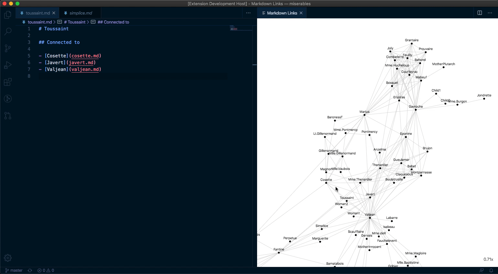

# Markdown Links

Adds command `Show Graph` that displays a graph of local links between Markdown files in the current working directory.

Gives better insights into structure of your files if you are writinga wiki, a Zettelkasten style notebook or documentation.



## Workflow

Recommended workflow is either keeping the graph open and using it as an alternative to the explorer sidebar or checking the it from time to time.

The graph refreshes automatically every time you:

- Update a Markdown title of the file.
- Change links to other files.
- Create a new file and add give it a title.
- Remove a file.

When active file in the editor changes and it matches one of the files in the graph – it will be highlighted.

## Concepts

- Title is always the first Markdown heading of depth 1, i.e. `# Title`.
- Files which do not have a title do not appear in the graph.
- Files can link to other files using [local Markdown links](docs/local-links.md), [ID-based links](docs/id-based-links.md), or `[file-name]` links.
- The graph is not directed. It doesn't show which file has the link and which one is linked.
- Directory structure is not relevant for the graph. All that matters is the mutual links between files.

## Example

```md
# Title

Link can be present in [text](first.md) or on a special list.

## Linked

- [Second](./2.md)

Named reference can also be used, like this: [Reference].

[reference]: ref.md
```

## Settings

This extension contributes the following settings:

### `markdown-links.showColumn`

Controls in which column should the graph appear. Refer to [Column values](####column-values). Defaults to `beside`.

### `markdown-links.openColumn`

Controls in which column should clicked files open. Refer to [Column values](###c#olumn-values). Defaults to `one`.

#### Column values

- `active` – in the currently focused column.
- `beside` – other than the current.
- `one` (**default**), `two`, `three`, `four`, `five`, `six`, `seven`, `eight`, `nine` – respective editor columns.

### `markdown-links.fileIdRegexp`

A [regular expression](https://developer.mozilla.org/en-US/docs/Web/JavaScript/Guide/Regular_Expressions) used to find the file ID for use in wiki-style links.

### `markdown-links.graphType`

- `default` (**default**)
- `obsidian` - obsidian like graph

### `markdown-links.titleMaxLength`

The maximum title length before being abbreviated. Set to 0 or less to disable.

#### Example

The sentence:

```
Type checking a multithreaded functional language with session types
```

When abbreviated for a maximum length of 24, becomes:

```
Type checking a multithr...
```

## Roadmap

Plans for development are roughly summarized in the [Roadmap](docs/roadmap.md).

## Changelog

Refer to the [CHANGELOG.md](CHANGELOG.md) file.

## Contributing

You are very welcome to open an issue or a pull request with changes.

If it is your first time with vscode extension, make sure to checkout [Official Guides](https://code.visualstudio.com/api/get-started/your-first-extension).
